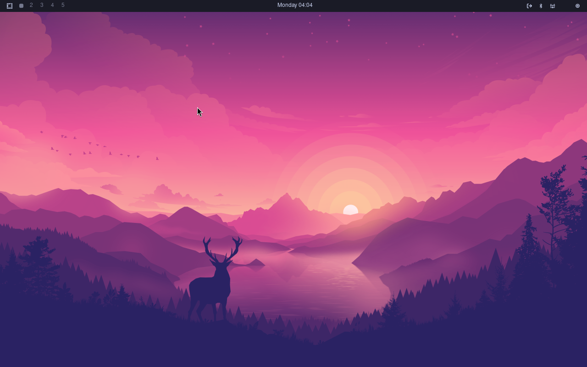

# Omarchy ARM64 VM

Complete [Omarchy Linux](https://github.com/basecamp/omarchy) environment running on ARM64 for Apple Silicon Macs via UTM.



## Quick Start

```bash
# SSH into VM
ssh omarchy@192.168.64.6
# Password: omarchy

# Start Omarchy environment
./start-omarchy.sh
```

The display will activate in the UTM window showing Hyprland with waybar.

## 📦 What's Included

- **OS:** Arch Linux ARM (aarch64)
- **Kernel:** 6.17.8-1-aarch64-ARCH
- **Compositor:** Hyprland 0.52.1 with Omarchy configs
- **Resolution:** 1280x800 via virtio-gpu-pci
- **Applications:** 100+ packages installed

### Key Features

✅ Omarchy's modular Hyprland configuration  
✅ Waybar status bar with Omarchy styling  
✅ Mako notification daemon  
✅ Complete CLI toolkit (bat, eza, ripgrep, fzf, etc.)  
✅ GUI apps (Chromium, Neovim, mpv)  
✅ 50+ Omarchy utility scripts  
✅ One-command startup  

## 📚 Documentation

- **[Build VM Guide](docs/BUILD-VM.md)** - Complete automated build instructions ⭐
- **[Quick Start Guide](docs/QUICKSTART.md)** - Get up and running fast
- **[UTM Setup Guide](docs/UTM-SETUP-GUIDE.md)** - Configure UTM properly
- **[Arch Install Guide](docs/arch-install-guide.md)** - Manual installation from scratch
- **[Hyprland Setup Notes](docs/hyprland-setup-notes.md)** - Compositor configuration
- **[Display Configuration](docs/configure-utm-display.md)** - Fix display issues
- **[Resize Disk](docs/RESIZE-DISK-INSTRUCTIONS.md)** - Expand VM storage
- **[Upgrade Strategy](docs/careful-upgrade-strategy.md)** - Safe system updates

## ⚡ Installation

### Option 1: Prebuilt VM (Torrent) 🆕

Download the ready-to-use VM via BitTorrent (13GB):

**Magnet Link:**
```
magnet:?xt=urn:btih:b8edadd5b6293ee2e72194cd9d4ff008d5a90b2f&dn=omarchy-arm64-vm-v1.0.0&tr=udp://tracker.opentrackr.org:1337/announce
```

Or download the [.torrent file](omarchy-arm64-vm-v1.0.0.torrent)

**What you get:**
- ✅ Complete Omarchy environment ready to use
- ✅ No installation or building required
- ✅ Just download, open in UTM, and start!

See **[Torrent Download Guide](TORRENT-DOWNLOAD.md)** for detailed instructions.

### Option 2: One-Command Installer

Build your own VM automatically:

```bash
curl -O https://raw.githubusercontent.com/potable-anarchy/omarchy-arm64-vm/main/installer/install-omarchy-vm.sh
chmod +x install-omarchy-vm.sh
./install-omarchy-vm.sh
```

**Time:** 5-10 minutes for VM creation, then 1-2 hours for OS installation

See [Installer Documentation](installer/README.md) for details.

### Option 3: Manual Build

For complete control over the process:

```bash
# Clone this repository
git clone https://github.com/potable-anarchy/omarchy-arm64-vm.git
cd omarchy-arm64-vm

# Follow the comprehensive build guide
open docs/BUILD-VM.md
```

### Option 2: Build from Scripts

```bash
# Clone repository
git clone https://github.com/potable-anarchy/omarchy-arm64-vm.git
cd omarchy-arm64-vm

# Build VM (requires UTM installed)
./scripts/build-archlinux-vm.sh

# Setup Omarchy inside VM
./scripts/setup-vm.sh
```

### Option 3: Manual Installation

Follow the detailed guides in `docs/` to build from scratch.

## 🎹 Keybindings (Omarchy Defaults)

| Key Combo | Action |
|-----------|--------|
| `SUPER + RETURN` | Open terminal (foot) |
| `SUPER + Q` | Close window |
| `SUPER + M` | Exit Hyprland |
| `SUPER + F` | Fullscreen |
| `SUPER + E` | App launcher (wofi) |
| `SUPER + B` | Web browser (chromium) |
| `SUPER + N` | Neovim |
| `SUPER + arrows` | Navigate windows |

## 📁 Project Structure

```
omarchy-arm64-vm/
├── docs/              # Documentation
├── scripts/           # Build and setup scripts
├── examples/          # Configuration examples
├── downloads/         # VM images and ISOs (gitignored)
├── README.md          # This file
├── PROGRESS.md        # Development history
├── LICENSE            # MIT License
└── CONTRIBUTING.md    # Contribution guidelines
```

## 🏗️ Architecture Notes

This is **not** a standard Omarchy installation - it's an adaptation for ARM64:

- ❌ Cannot run official Omarchy installer (x86_64 only)
- ✅ All configurations work perfectly
- ✅ Most applications available on ARM64
- ⚠️ Some x86_64-only apps excluded (1Password, Steam, etc.)

### Differences from x86_64 Omarchy

1. **No uwsm session manager** - Apps launched via hyprctl
2. **No Limine/Btrfs** - Using standard ext4 + boot
3. **Manual app launch** - startup script instead of autostart
4. **ARM64 package availability** - Some apps unavailable

### GPU Performance

⚠️ **Important:** UTM uses QEMU's `virtio-gpu-pci` which only supports OpenGL 2.1. Hyprland requires OpenGL 3.0+, resulting in:
- Laggy rendering on M1/M2 Macs
- TUI windows may appear empty or glitchy
- Acceptable performance on M3+ Macs

For better GPU performance, consider **Parallels Desktop** (commercial) or simpler compositors like Sway.

## 🛠️ Useful Commands

```bash
# Control Hyprland
export HYPRLAND_INSTANCE_SIGNATURE=$(ls -t /run/user/1001/hypr/ | head -1)
hyprctl monitors
hyprctl clients
hyprctl dispatch exec <app>

# Launch apps
hyprctl dispatch exec chromium
hyprctl dispatch exec foot
hyprctl dispatch exec nvim

# Take screenshot
grim -g "$(slurp)" screenshot.png

# System info
fastfetch
btop
```

## 🤝 Contributing

Contributions welcome! See [CONTRIBUTING.md](CONTRIBUTING.md) for guidelines.

### Areas for Contribution

- **Installer Scripts** - Automated VM building
- **Performance Improvements** - GPU optimization
- **Documentation** - Setup guides, troubleshooting
- **Package Updates** - Keep dependencies current
- **Bug Fixes** - Display issues, app compatibility

## 📋 System Requirements

- **Mac:** Apple Silicon (M1, M2, M3, M4)
- **macOS:** 12.0+ (Monterey or later)
- **UTM:** Latest version
- **RAM:** 4GB+ recommended for VM
- **Disk:** 20GB+ for VM image

## 🔗 Credits & Resources

- **Omarchy:** [github.com/basecamp/omarchy](https://github.com/basecamp/omarchy) by DHH/37signals
- **Hyprland:** [hyprland.org](https://hyprland.org)
- **Arch Linux ARM:** [archlinuxarm.org](https://archlinuxarm.org)
- **UTM:** [mac.getutm.app](https://mac.getutm.app)

## 📄 License

MIT License - see [LICENSE](LICENSE) for details.

---

**Status:** Production ready ✅  
**Last Updated:** November 19, 2025
